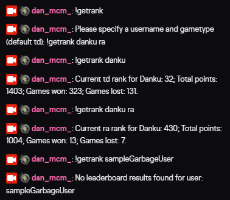

# CNCbot

A twitch bot for enabling quick user lookup of player ranks in chat using the public OBS API - docs available [here](https://cnc.community/news/official-news/new-streamer-cc-remastered-apis-available-for-obs)

Note: If you wish to enable this functionality with Nightbot `WarMachine` has advised this is configurable via nightbot with the following command

```
$(eval a = `$(urlfetch json https://cnc.community/api/leaderboard/tiberian-dawn/players/search?search=$(query))`; js = JSON.parse(a); `[CnC Ladder] Player Name: ${js[0].player_name} | Rank: ${js[0].rank} | Wins: ${js[0].wins} | Losses: ${js[0].losses} | Points: ${js[0].points}`)
```

## Local Setup

### Bot Configuration & Authentication

You will need to register your own twitch bot to enable tmi.js to post to Twitch. Bots can be registered with Twitch [here](https://dev.twitch.tv/console).

The bot requires the configuration of the following global variables:

```
USERNAME="your-registered-bot-name"
OAUTH="oauth:your-tmi-oauth-token"
CHANNEL="yourtwitchchannelname"
```

As `dotenv` is enabled on the project all you need to do is create a file called `.env` in the root of the project and copy and paste in the above variables with your own values.


TMI oauth token configuration can be obtained here `https://twitchapps.com/tmi/`


## Installation & Running

This project is written in JS and requires node and either npm or yarn to run. (if using npm replace commands below with `npm` instead of `yarn`)

* To install node see [here](https://nodejs.org/en/download/)
* To install yarn see [here](https://classic.yarnpkg.com/en/docs/install/#windows-stable)
* To install npm see [here](https://www.npmjs.com/get-npm)

Once you have node & either yarn or npm setup open a [cmd terminal](https://devblogs.microsoft.com/commandline/introducing-windows-terminal/) and run the following

```
// install dependencies
yarn install

// start bot
yarn start
```

Note: bot will only run so long as you have it running locally - this is currently not configured on a public server for permanent access.


### Sample Usage



## Questions / Feature Requests

Looking for extending functionality or have a question/issue with starting the bot? Feel free to open up an issue ticket [here](https://github.com/dan-mcm/cncbot/issues). I'll aim to get back to you as soon as I can.
